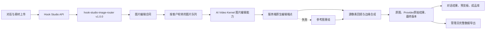

# 图片编辑与公平调度架构 v1

## 纵向链路

## 层次职责

| 层 | 职责 | 不负责 |
| --- | --- | --- |
| 交互层 | 收集一句话需求、原图、可选蒙版与可选定位图；展示任务进度、版本和成品 | 不持有密钥，不直连 Provider |
| 合同与 Skill 层 | 判断图片领域和真实性等级，声明素材角色、允许变化、必须保持、降级和 QC | 不把概念图冒充 CAD 或可运行 UI |
| 调度层 | 图片/视频分队列，客户轮转，展示真实排队位；批量任务一次只占一个 Provider 槽 | 不把固定并发数写成产品能力 |
| 调用层 | Hook Studio 只调用 Kernel capability API；Kernel 读取服务端 secret 并调用编辑或生成端点 | 不向前端返回凭证和原始授权头 |
| 合成层 | 蒙版存在时把蒙版外区域确定性恢复为源图像素 | 不承诺模型原生编辑严格服从边界 |
| 数据层 | SQLite 保存合同、Skill 运行、素材、资产版本、任务、事件和训练样本；JSONL 双写行为事件 | 不保存服务端密钥 |

## 降级顺序

1. 原图 + 可选蒙版 + 可选定位图调用服务端编辑端点。
2. 端点不可用或拒绝时，使用原图和可选定位图做参考重绘。
3. 蒙版存在时，用本地合成恢复蒙版外源像素。
4. 无蒙版时明确标记为 best-effort 编辑，保留原图和每个候选版本供回滚。
5. 仍失败时保留任务、错误类别和额度释放记录，不返回空白页。

## 数据可取回性

管理后台的“导出完整数据包”生成 ZIP。每张数据库表各自输出一个 JSONL，并带 manifest、schema 版本和行数。访问码、Provider 凭证与 session secret 明确排除。训练数据可继续单独导出，便于后续清洗、偏好学习和路由优化。
